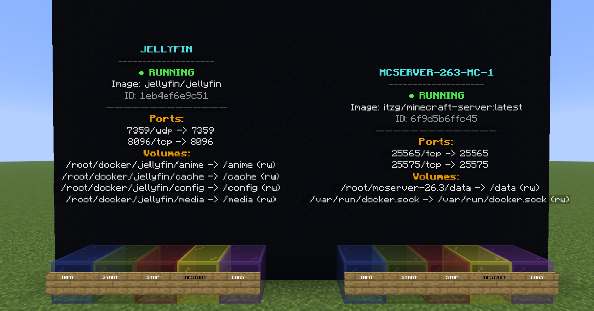
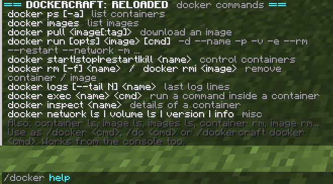
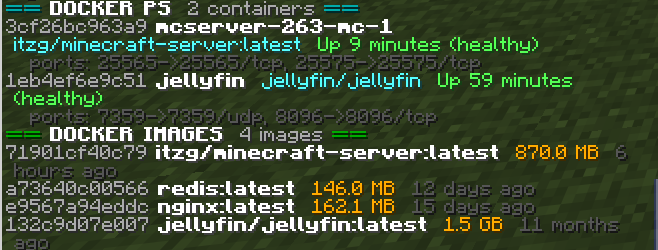

# DockerCraft: Reloaded

Manage your **Docker containers from inside Minecraft** with
real **`docker` commands typed in Minecraft (`docker ps`,
`docker run -d nginx`, `docker pull redis`, `docker images`, ...):



| Button | Color | Action |
|---|---|---|
| INFO | blue | Container details in chat |
| START | green | Starts the container |
| STOP | red | Stops the container |
| RESTART | yellow | Restarts the container |
| LOGS | purple | Last logs in chat |

## Content

```
dockercraft-reloaded/
├── python/    Python script (RCON): dockercraft_reloaded.py + dockercraft_cli.py (docker commands)
├── plugin/    Paper plugin source code (Gradle)
├── build/     build.sh (Linux/macOS) and build.bat (Windows) → produce the .jar
└── docs/      Architecture and security notes
```

There are **two ways** of doing the same thing:

| | `python/` (RCON) | `plugin/` (Paper) |
|---|---|---|
| What it is | Script that talks to the mc server over RCON | `.jar` that runs inside the server |
| Click detection | Periodic polling | Native events |
| Permissions | `ALLOWED_PLAYERS` in the script | Bukkit permissions (OPs, LuckPerms…) |

---

## A. Paper plugin — Minecraft 26.3 (experimental)

> Paper 26.3 is in **beta** and its API may still change. The project is pinned to
> `paper-api 26.3.build.134-beta`; when releases come out, just change that line.

### 1. Requirements
- **Paper 26.3** server running on **Java 25** or above.
- The user running Paper must be able to read `/var/run/docker.sock` (see below)

### 2. Build the `.jar`

| System | Command |
|---|---|
| Linux / macOS | `./build/build.sh` |
| Windows | `build\build.bat` |

The result is **`build/out/DockerCraft-Reloaded-0.2.0.jar`**.

The scripts use: `plugin/gradlew` if present.
The simplest setup is installing Gradle 9.8+: **you do not need to install JDK 25 by hand**, Gradle downloads it for you.
To keep `gradlew` in the repository, run once `cd plugin && gradle wrapper --gradle-version 9.8.0` and commit `gradlew`, `gradlew.bat` and `gradle/`.

**Switching Paper build**: `-PpaperApi=26.3.build.+` (latest) or a specific one, e.g.
`cd plugin && gradle build -PpaperApi=26.3.build.140-beta`.

### 3. Install
1. Copy the `.jar` from `build/out/` into `plugins/` and start the server.
2. Edit `plugins/DockerCraft/config.yml` (world, coordinates (default is 0,0), `docker.host`…) and run `/dockercraft reload`.

### Commands and permissions
| Command | Description |
|---|---|
| `/dockercraft status` | Number of containers on the panel |
| `/dockercraft rebuild` | Redraws the panel now |
| `/dockercraft reload` | Reloads `config.yml` and redraws |
| `/docker <command>` | Docker CLI (alias of `/dockercraft docker <command>`, also `/dc <command>`) |

| Permission | Default | Purpose |
|---|---|---|
| `dockercraft.view` | everyone | INFO and LOGS buttons; `docker ps/images/logs/inspect/network ls/volume ls/version/info` |
| `dockercraft.control` | OP | START / STOP / RESTART buttons; `docker start/stop/restart/kill/pause/unpause` |
| `dockercraft.docker.pull` | OP | `docker pull`, `docker rmi` |
| `dockercraft.docker.run` | OP | `docker run`, `docker exec`, `docker rm` |
| `dockercraft.admin` | OP | `/dockercraft status/rebuild/reload` |

### Docker commands
Type them in game (`/docker ps`). Tab-completion suggests commands and container names.



| Command | What it does |
|---|---|
| `docker ps [-a]` | List containers (`-a` includes stopped ones) |
| `docker images` | List images (`docker image ls` / `docker images ls` work too) |
| `docker pull <image[:tag]>` | Download an image |
| `docker run [options] <image> [cmd...]` | Create and start a container. Always detached (`-d`). Pulls the image if missing |
| `docker start\|stop\|restart\|kill\|pause\|unpause <name...>` | Control containers (name, id or unique prefix) |
| `docker rm [-f] [-v] <name...>` / `docker rmi [-f] <image...>` | Remove containers / images |
| `docker logs [--tail N] <name>` | Last log lines |
| `docker exec <name> <cmd...>` | Run a command inside a running container (no TTY) |
| `docker inspect <name>` | Container details |
| `docker network ls`, `docker volume ls`, `docker version`, `docker info` | Misc |

`docker run` understands `--name -p -v -e --rm --restart --network -w -u -m --entrypoint -l -h
--privileged --cap-add --device --pid -P --read-only` (`-p 8080:80`, `-p8080:80`, `--name=web` and
`"quoted values"` all work). Examples:
```
/docker run -d --name web -p 8080:80 nginx
/docker logs --tail 50 web
/docker rm -f web
```




**Safe mode** (`commands.safe-mode: true`, the default) makes `docker run` refuse `--privileged`,
`--cap-add`, `--device`, `--pid host`, `--network host` and bind mounts of host paths
(`-v /etc:/x`). Named volumes (`-v mydata:/data`) are fine. Set it to `false` only if
everyone with `dockercraft.docker.run` is as trusted as the machine's root user.
Set `commands.enabled: false` to turn all docker commands off.

### **IMPORTANT**: Docker socket access
Paper must be able to open `/var/run/docker.sock`.

**Paper running on the host:** add its user to the `docker` group and restart the process.
```bash
sudo usermod -aG docker PAPER_USER
```

**Paper running in Docker (e.g. `itzg/minecraft-server`):** mount the socket and give the
container the socket's group. Get the GID with `stat -c '%g' /var/run/docker.sock`.
```yaml
services:
  mc:
    image: itzg/minecraft-server:latest
    user: "1000:1000"
    group_add:
      - "999"                  # the socket's GID
    volumes:
      - /var/run/docker.sock:/var/run/docker.sock

services:
  mc:
    image: itzg/minecraft-server:latest
    user: "1000:1000"
    group_add:
      - "999"                  # the socket's GID
    pull_policy: daily
    tty: true
    stdin_open: true

    ports:
      - "25565:25565"
      - "25575:25575"

    environment:
      EULA: "TRUE"
      TYPE: "PAPER"
      VERSION: "26.3"
      PAPER_CHANNEL: "experimental"

    volumes:
      - ./data:/data
      - /var/run/docker.sock:/var/run/docker.sock  # the docker socket
```
Make sure `./data` is owned by UID 1000 (`sudo chown -R 1000:1000 ./data`).
A [socket proxy](docs/security.md) is a safer alternative.

---

## B. Python script (RCON)

```bash
# Install dependecies
pip install docker rcon
cd python
# Running main script
python dockercraft_reloaded.py
```
In `server.properties`: `enable-rcon=true`, `rcon.port=25575`, `rcon.password=...`.
Edit the constants at the top of the script (password, coordinates…).

**Docker commands** players can use `!docker ps` / `!dc images` in the Minecraft chat (see
`CHAT_LOG_PATH` and `COMMAND_PLAYERS`). Details in [`python/README.md`](python/README.md).

---

## Security

Access to the Docker socket is equivalent to **root on the machine**. Anyone who can press
START/STOP/RESTART controls containers that may mount any folder of the host.

- Grant `dockercraft.control` and especially `dockercraft.docker.run` only to people you fully trust.
  `docker run` can start anything, so keep `commands.safe-mode: true` unless you really need otherwise.
- Python script: an empty `ALLOWED_PLAYERS` means **anyone can control containers**; fill it in.
  Chat commands are off by default and only work for players listed in `COMMAND_PLAYERS`.
  Do not expose the RCON port to the Internet and use a long, unique password.

More in [`docs/security.md`](docs/security.md).

## Troubleshooting

| Symptom | Likely cause |
|---|---|
| `paper-api:26.3.build.134-beta` does not resolve | Build was withdrawn: try `-PpaperApi=26.3.build.+` |
| The plugin does not load | Server is not on Java 25 or not 26.3 (`api-version: "26.3"`) |
| `permission denied` on the socket | Paper's user is not in the `docker` group (see above) |
| The panel does not appear | Try `/dockercraft rebuild` to redraw the containers in the world |
| `docker run` says "Blocked by safe-mode" | You used `--privileged`, a host-path `-v`, `--network host`... Use named volumes or disable `commands.safe-mode` |
| `!docker` in chat does nothing (Python) | `CHAT_LOG_PATH` wrong, player not in `COMMAND_PLAYERS`, or the log is not `logs/latest.log` |
| Buttons do not respond | Chunk unloaded: keep `keep-chunks-loaded: true` |
| Text too tall or outside the wall | Many ports/volumes: adjust `line-spacing` (0.30 = same as the script) or raise `wall-height` |

## Important

> **Dockercraft: Reloaded** is an independent, from-scratch reimplementation inspired by the original [Dockercraft](https://github.com/docker-archive-public/docker.dockercraft) project, which is no longer maintained. It is not affiliated with or endorsed by the original authors.

## License

[MIT](LICENSE)